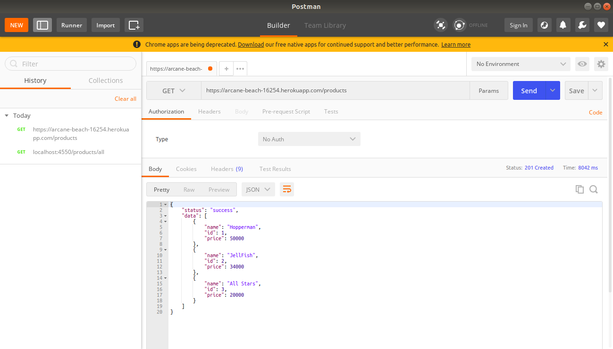
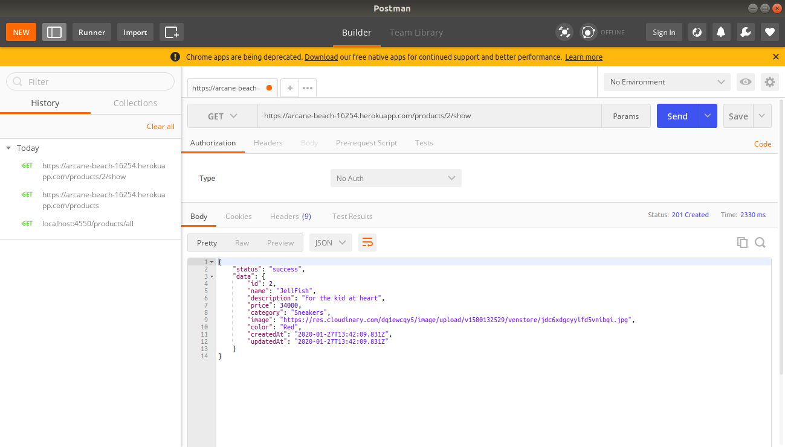
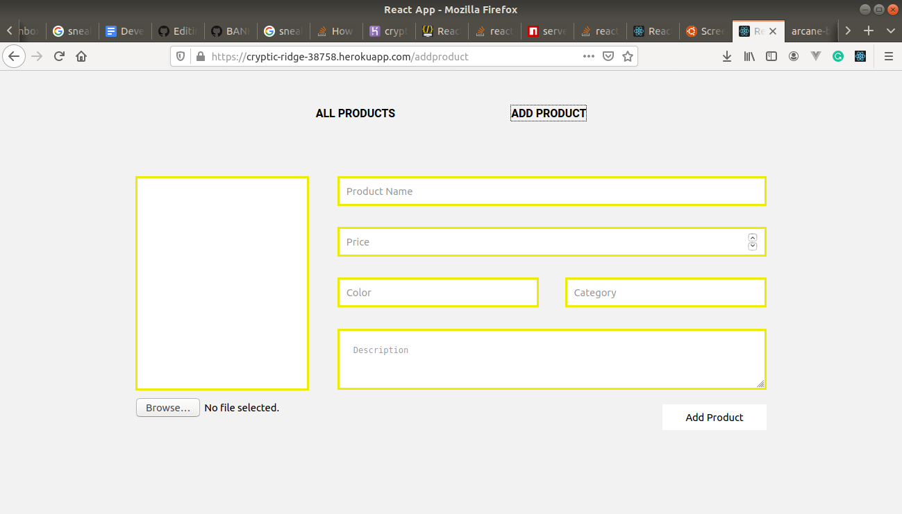
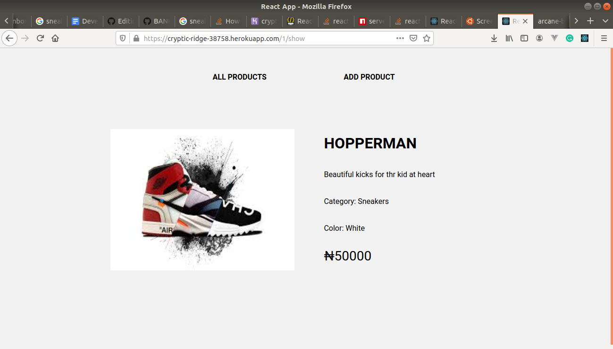

  Ven10 Developer Assessment
  <a href="https://github.com/fegzycole/DTA-frontend/issues">Report Bug</a>
  <a href="https://github.com/fegzycole/DTA-frontend/issues">Request Feature</a>

### Frontend Implementation With ReactJS

[Live Version](https://cryptic-ridge-38758.herokuapp.com/addproduct)

### Backend Implementation With NodeJS

[Live Version](https://arcane-beach-16254.herokuapp.com/)

## Project Specifications

- An API which lists all products showing some of their properties
  - ID
  - Name
  - Price

- A Detail API which shows all the properties of a specific product
  - ID
  - Name
  - Description
  - Price
  - Category
  - Image
  - Color

- A webpage which allows you to add a new product 

- Show the user a preview page of the product they just added

### Built With

This project was built with Node.js

## Prerequisites
 - Git
 - Yarn
 - Node.js
 - NPM

## Getting Started

- git clone https://github.com/fegzycole/DTA-frontend.git

- cd DTA-frontend

- npm install

- npm start
